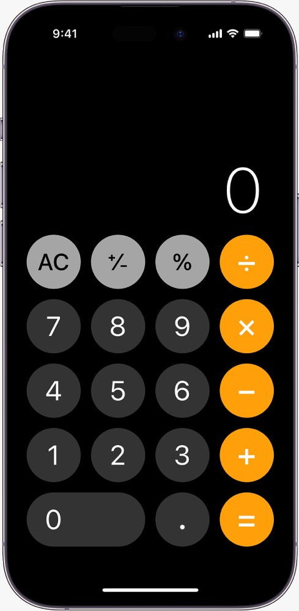
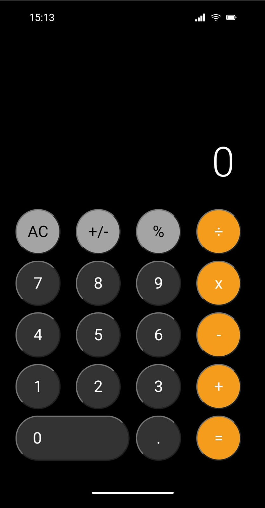
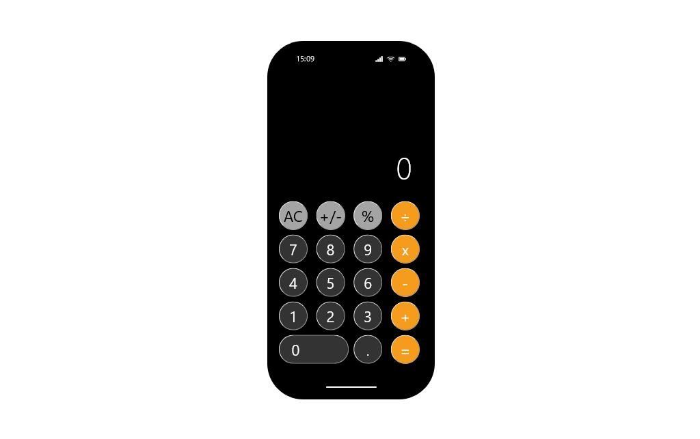

# Technical Test - Calculator app solution

This is a solution for the technical test required by a company in the selection process for the position of software developer.

## Table of contents

- [Overview](#overview)
  - [The challenge](#the-challenge)
  - [Screenshot](#screenshot)
  - [Links](#links)
- [My process](#my-process)
  - [Built with](#built-with)
- [Author](#author)

## Overview

### The challenge

- Faithfully layout the calculator application based on the provided image using HTML, SASS and Bootstrap.

- Implement the respective functionalities of the calculator, including addition, subtraction, multiplication, division, etc., using JavaScript.

- Users should be able to see the size of the elements adjust based on their device's screen size.

- You can use frameworks such as React, Angular, or others.

### Screenshot

### Links

- Solution URL: [Github](https://github.com/SFCC5555/vic-data-react-bootstrap)
- Live Site URL: [Calculator App](https://sfcc-calculator.netlify.app/)

## My process

### Built with

- Semantic HTML5 markup
- CSS custom properties
- Flexbox
- CSS Grid
- Mobile-first workflow
- JavaScript
- Bootstrap
- Sass
- JSON
- [React](https://reactjs.org/) - JS library

## Author

- [Website](https://sfcc5555.netlify.app/)
- [LinkedIn ](https://www.linkedin.com/in/fernando-carrasco-dev/)
